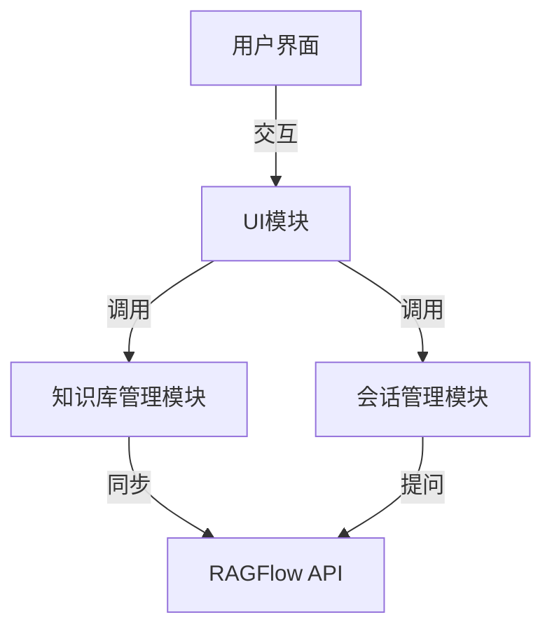
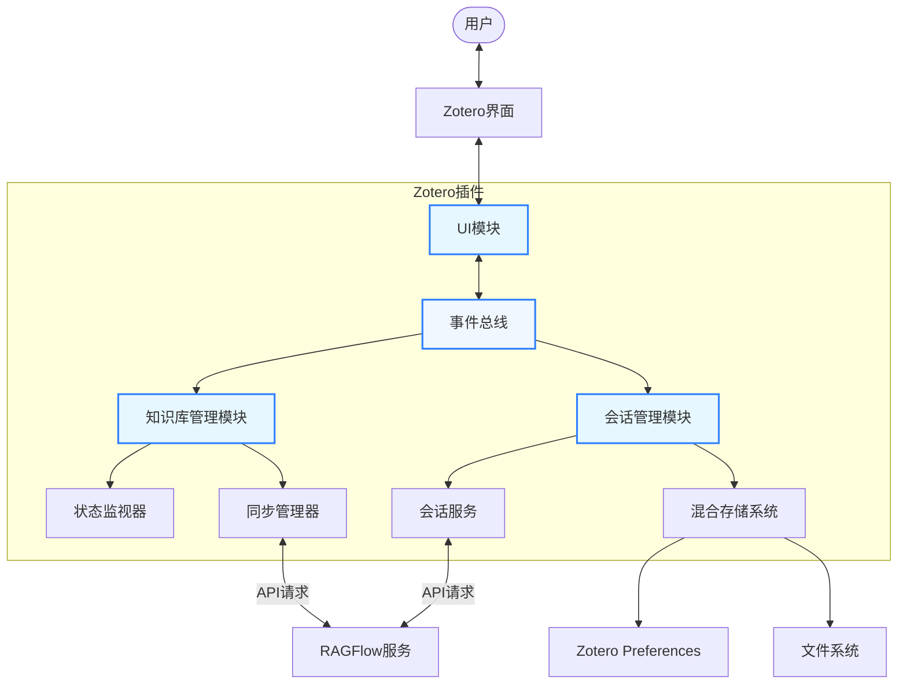
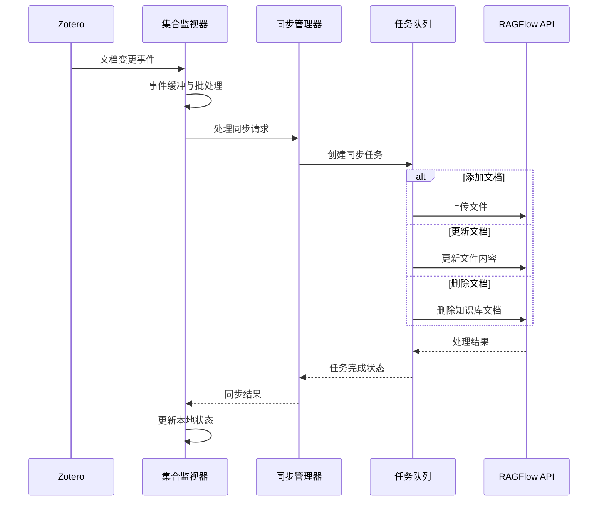
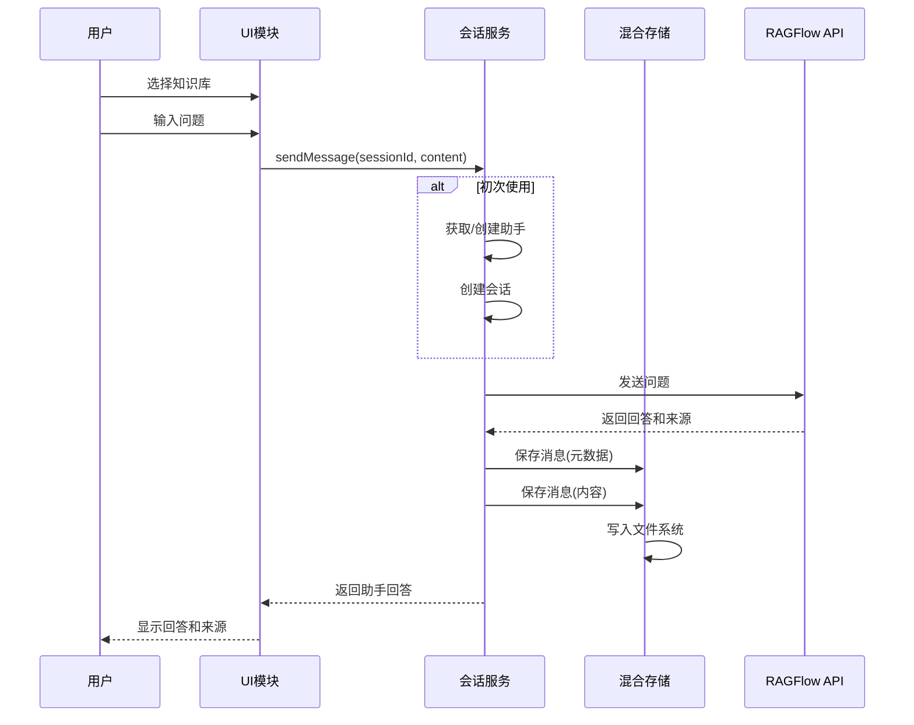

# Zotero-RAGFlow 插件 

---
Zotero-RAGFlow是一款将RAG（检索增强生成）技术集成到Zotero中的插件，让研究人员和学者能够基于自己的文献资料构建知识库并进行智能问答。通过该插件，用户可以直接将Zotero条目中的附件文档上传到RAGFlow服务，构建个性化知识库，并利用大语言模型对自己的文献进行提问和分析。

## 功能特点

- **知识库构建**：将Zotero集合中的附件文件上传到RAGFlow服务，自动构建知识库
- **智能问答**：基于自己的文献资料进行提问，获取精准回答
- **参考来源追踪**：回答内容附带原始文档参考来源，确保可溯源性
- **多种模型支持**：提供多种大语言模型选择，如deepseek-chat、qwen-turbo等
- **参数自定义**：可配置温度、相似度阈值等关键参数
- **历史记录管理**：保存问答历史，支持重复提问和回答复制
- **本地部署支持**：支持连接本地部署的RAGFlow服务

## 安装说明

1. 下载最新版本的`zotero-ragflow.xpi`插件文件
2. 在Zotero中打开"工具" > "附加组件"
3. 点击齿轮图标，选择"从文件安装附加组件"
4. 选择下载的`zotero-ragflow.xpi`文件
5. 重启Zotero完成安装

## 配置设置

首次使用前，需完成以下配置：

1. 点击"工具" > "RAGFlow设置"或顶部菜单栏"RAGFlow" > "设置"
2. 输入RAGFlow API密钥
3. 设置RAGFlow API URL
   - 本地部署默认为`http://127.0.0.1:8000`
   - 云服务使用提供商指定的URL

## 使用指南

### 创建知识库

1. 在Zotero中选择一个包含文献的集合
2. 右键单击该集合，选择"发送到RAGFlow知识库"
3. 在弹出的确认对话框中点击"确定"
4. 系统将自动上传集合中的附件文件并构建知识库
   - 支持PDF、Word文档、文本文件等格式
   - 不支持HTML快照文件

### 选择知识库

1. 点击顶部菜单"RAGFlow" > "选择已有知识库"
2. 从列表中选择要使用的知识库

### 配置聊天助手

1. 点击"RAGFlow" > "聊天助手设置"
2. 选择模型（如deepseek-chat、qwen-turbo等）
3. 调整参数：
   - 温度：控制回答的创造性（0-1）
   - 相似度阈值：控制文档检索的相关性要求
   - 检索结果数量：影响参考来源数量

### 知识库问答

1. 点击"RAGFlow" > "RAGFlow知识库问答"
2. 在对话框中输入您的问题
3. 点击"提问"按钮
4. 系统会显示回答结果及其参考来源

### 查看历史记录

1. 点击"RAGFlow" > "查看问答历史"
2. 浏览之前的问答记录
3. 可以复制回答或再次提问相同问题

## 模块架构

RAGFlow插件采用模块化设计，由三个核心模块组成，实现了系统的高内聚低耦合。

### 主要模块



### 1. 知识库管理模块

知识库管理模块负责Zotero集合与RAGFlow知识库之间的同步、状态监控和错误处理。

**核心功能**：
- 知识库状态监控与管理
- Zotero集合到知识库的同步
- 增量更新与冲突处理
- 任务队列与优先级管理
- 错误恢复与容错机制

[查看详细文档](src/modules.next/services/core/knowledge/README.md)

### 2. 会话管理模块

会话管理模块处理用户与AI助手之间的对话，管理会话状态和消息存储。

**核心功能**：
- 会话创建与管理
- 知识库与助手的关联
- 混合存储策略实现
- 消息的发送与接收
- 会话历史的持久化

[查看详细文档](src/modules.next/services/core/session/README.md)

### 3. UI模块

UI模块负责用户界面元素的呈现和交互逻辑，与Zotero原生界面的集成。

**核心功能**：
- 菜单与对话框管理
- 知识库选择与问答界面
- 助手设置与参数配置
- 事件驱动的UI更新
- 错误提示与用户通知

[查看详细文档](src/modules.next/ui/README.md)

## 高级系统架构

### 整体架构



### 知识库同步流程



### 会话管理流程



## 开发者文档

### 代码组织结构

```
src/modules.next/
├── services/                # 核心服务层
│   ├── core/                # 核心功能模块
│   │   ├── knowledge/       # 知识库管理模块
│   │   └── session/         # 会话管理模块
│   ├── logger.ts            # 日志服务
│   └── ragflow.ts           # RAGFlow API服务
├── ui/                      # 用户界面模块
│   ├── assistantSettingsDialog.ts  # 助手设置对话框
│   └── uiManager.ts         # UI管理器
└── index.ts                 # 模块导出
```

### 核心设计模式

RAGFlow插件实现了多种设计模式和架构策略：

1. **单例模式**：核心服务如KnowledgeBaseManager和SessionService使用单例确保全局一致性
2. **观察者模式**：基于事件总线实现组件间的松耦合通信
3. **命令模式**：使用任务队列和异步执行器处理长时间运行的操作
4. **策略模式**：实现不同类型文档的处理策略
5. **适配器模式**：适配Zotero API和RAGFlow API的差异
6. **工厂方法**：创建各种复杂对象的实例

### 使用混合存储策略

会话模块实现了创新的混合存储策略，解决了Zotero Preferences存储大型数据的限制：

- **小体积元数据**：存储在Zotero Preferences
- **大体积内容**：存储在文件系统
- **多级容错**：内存缓存作为备份机制

### 开发环境设置

1. 克隆代码库：`git clone https://github.com/your-org/zotero-ragflow.git`
2. 安装依赖：`npm install`
3. 构建项目：`npm run build`
4. 测试：`npm test`
5. 打包：`npm run build:production`

### API接口文档

详细的API文档可在各模块的README文件中找到：

- [知识库管理API](src/modules.next/services/core/knowledge/README.md#核心组件)
- [会话管理API](src/modules.next/services/core/session/README.md#核心组件)
- [UI组件API](src/modules.next/ui/README.md#核心组件)

## 技术细节

### 支持的文件类型

- PDF文档 (.pdf)
- Word文档 (.doc, .docx)
- 文本文件 (.txt)
- 其他RAGFlow支持的文件类型

**注意:** 当前不支持HTML快照文件

### 模型选项

可用的大语言模型:

- deepseek-chat
- qwen-turbo
- qwen-max
- qwen-plus
- qwen-long
- gpt-4o
- gpt-3.5-turbo

### 存储管理

- 会话消息内容保存在Zotero数据目录的`ragflow/messages`文件夹中
- 助手配置、会话元数据等保存在Zotero Preferences中
- 知识库状态、同步配置和映射关系也保存在Zotero Preferences中

## 常见问题

1. **问: 为什么我的HTML快照无法上传?**  
   答: 当前版本不支持HTML快照文件，请使用PDF或文本文件。

2. **问: 如何切换不同的知识库?**  
   答: 点击"RAGFlow" > "选择已有知识库"，从列表中选择。

3. **问: 如何优化问答质量?**  
   答: 调整聊天助手设置中的参数，特别是相似度阈值和温度值。

4. **问: API余额不足怎么办?**  
   答: 登录RAGFlow平台充值或联系服务提供商。

5. **问: 消息存储在哪里，如何备份？**  
   答: 消息内容存储在Zotero数据目录的`ragflow/messages`文件夹中，备份Zotero数据目录即可保留会话历史。

6. **问: 当同步过程中断后如何恢复？**  
   答: 插件实现了自动恢复机制，您也可以右键点击集合选择"重新同步到RAGFlow"。

## 注意事项

- 知识库构建需要时间，取决于文档数量和大小
- 大型文档集合可能需要较高的处理资源
- 请确保有足够的API余额用于处理请求
- 处理敏感数据时请考虑数据隐私和安全性
- 如遇到同步或问答问题，查看各模块的详细文档可能会有所帮助

## 贡献指南

欢迎对本项目做出贡献！如果您想要参与开发，请：

1. 查看[完整的设计文档](#模块架构)
2. 阅读特定模块的详细文档
3. 遵循代码风格和测试规范
4. 提交PR前请先解决所有lint和测试问题

## 许可信息

此插件基于[MIT许可证](LICENSE)发布。

---

_Zotero-RAGFlow: 让文献知识流动起来_
