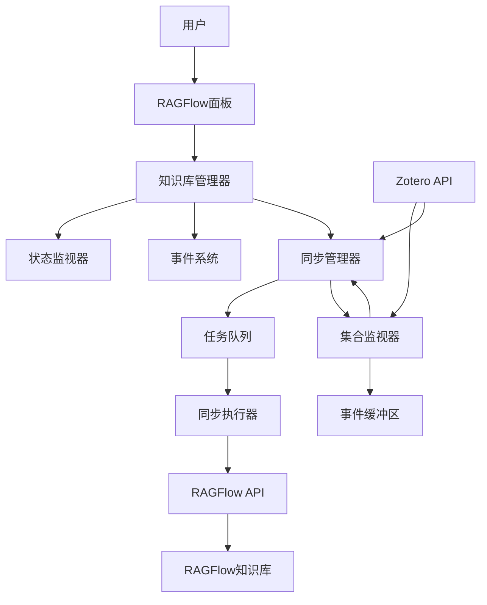
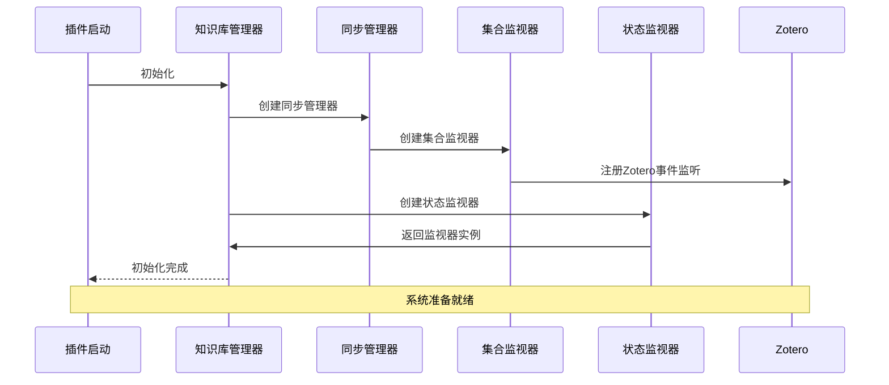
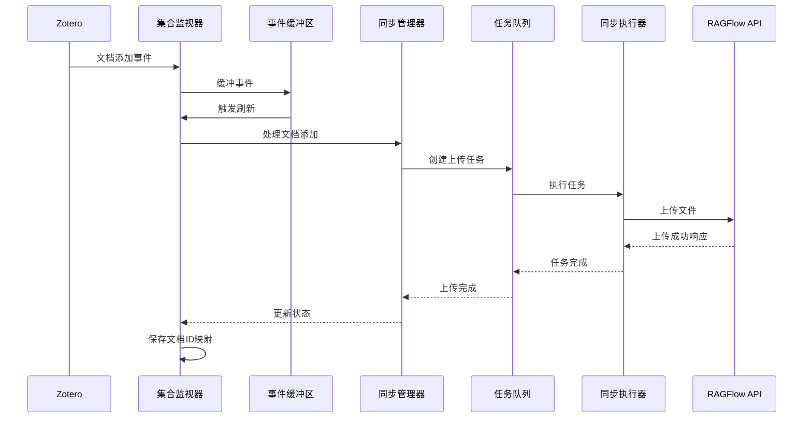
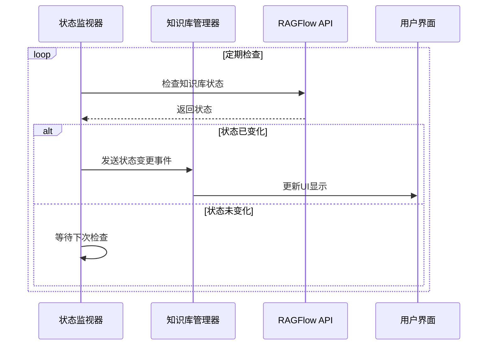
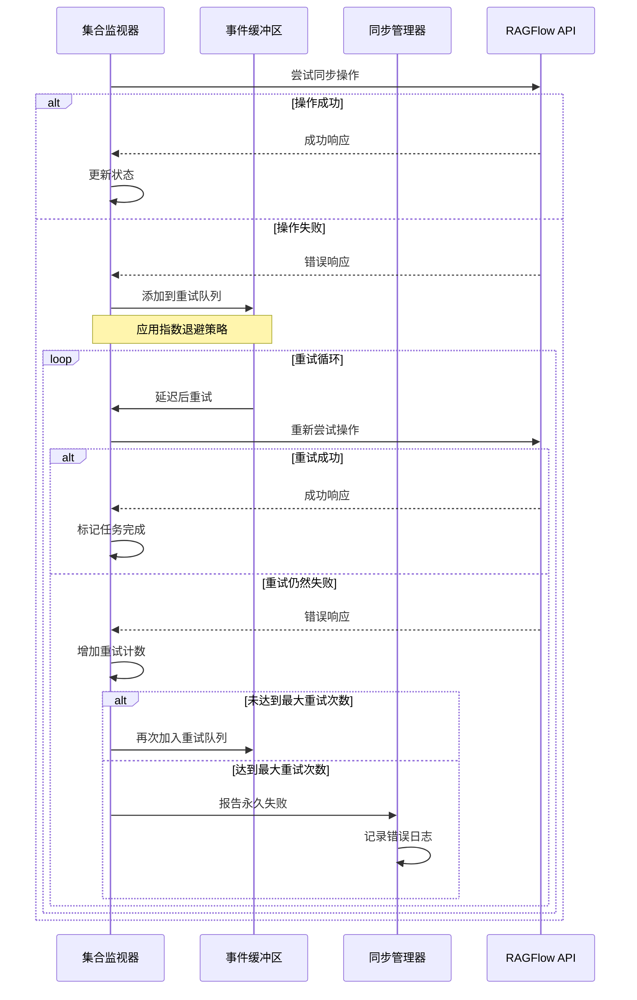
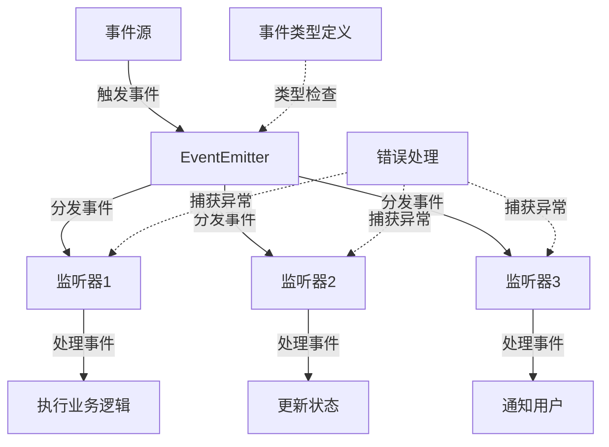
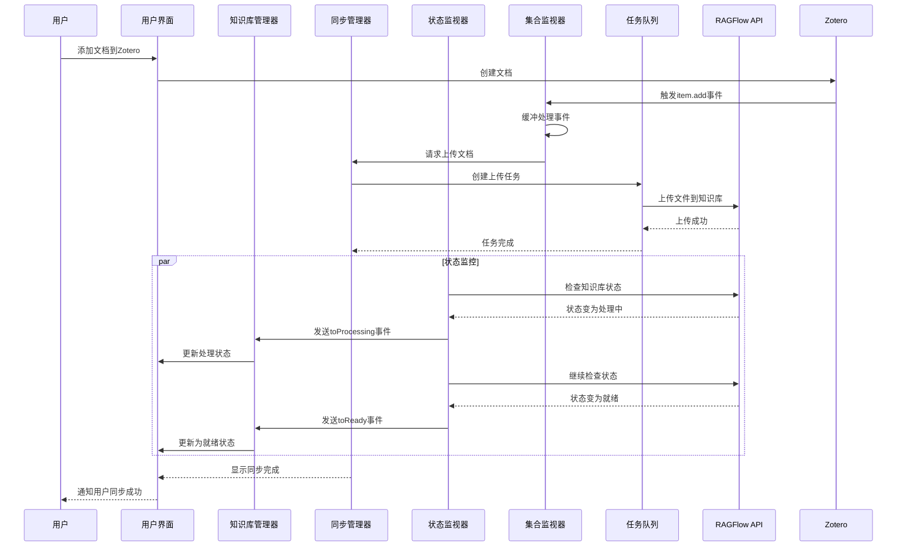
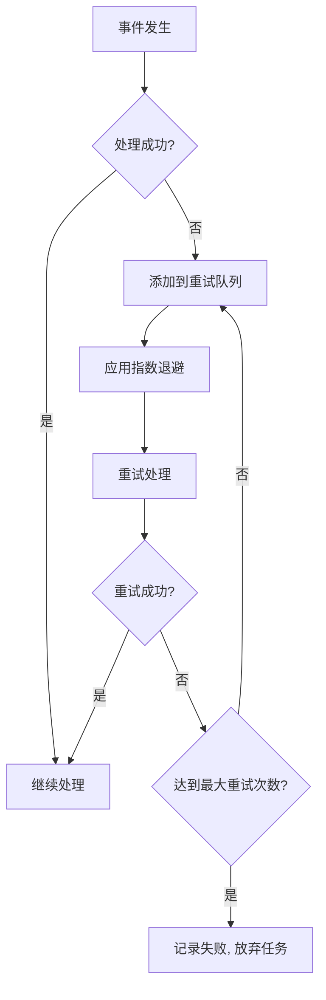

# 知识库管理模块

## 模块概述

知识库管理模块是一个强大的知识库状态监控、同步和错误处理系统，提供了完整的事件驱动架构，支持Zotero集合与RAGFlow知识库之间的高效同步。本模块采用多种高级设计模式实现了可靠的错误恢复、优先级处理和资源管理。

## 系统架构



## 组件协同工作流程

### 1. 系统初始化流程



### 2. 文档添加同步流程



### 3. 状态监控流程



### 4. 错误处理与恢复流程



### 5. 事件驱动通信流程



### 6. 组件交互完整流程



## 核心组件

### 1. 知识库管理器 (KnowledgeBaseManager)

知识库管理器是整个模块的核心，负责协调所有子组件的工作。它实现了单例模式，确保系统中只有一个管理器实例。

主要功能：
- 管理知识库状态和元数据
- 定期轮询检查知识库状态变化
- 处理错误并支持自动重试
- 发送状态变化事件通知
- 管理同步配置和任务

代码示例：
```typescript
// 获取知识库管理器实例
const manager = KnowledgeBaseManager.getInstance();

// 添加知识库观察器
manager.addWatcher({
  id: "kb-123",
  name: "我的论文集",
  interval: 10000, // 10秒检查一次
  handlers: {
    onStatusChanged: (id, status) => console.log(`状态变化: ${status.status}`)
  }
});

// 获取知识库状态
const status = await manager.getStatus("kb-123");
```

### 2. 事件系统 (EventEmitter)

事件系统提供了一个类型安全的事件总线，处理模块内部和外部组件间的通信。支持泛型事件处理，确保类型安全。

特点：
- 使用泛型实现类型安全的事件处理
- 支持事件订阅/取消订阅
- 保护事件处理器不受错误影响
- 提供事件监听器统计功能

代码示例：
```typescript
const eventEmitter = new EventEmitter();

// 订阅事件
eventEmitter.on<KnowledgeBaseEvent>("statusChanged", (event) => {
  if (event.type === "toReady") {
    console.log(`知识库 ${event.id} 已就绪`);
  }
});

// 发送事件
eventEmitter.emit("statusChanged", { 
  type: "toReady", 
  id: "kb-123" 
});

// 取消订阅
eventEmitter.off("statusChanged", myHandler);
```

### 3. 任务队列 (TaskQueue)

任务队列实现了异步任务的优先级排序、并发控制和错误重试机制。支持任务暂停、恢复和取消。

关键特性：
- 任务优先级排序
- 可配置的并发执行任务数
- 自动错误重试机制
- 完整的任务生命周期事件
- 任务状态跟踪和进度报告

代码示例：
```typescript
const taskQueue = new TaskQueue();

// 添加高优先级任务
await taskQueue.enqueue(
  async () => { /* 任务执行逻辑 */ },
  {
    id: "task-1",
    priority: TaskPriority.High,
    onProgress: (progress) => console.log(`进度: ${progress.percent}%`),
    onComplete: () => console.log("任务完成"),
    onError: (error) => console.error("任务失败", error)
  }
);

// 暂停任务
taskQueue.pauseTask("task-1");

// 恢复任务
taskQueue.resumeTask("task-1");

// 取消任务
taskQueue.cancelTask("task-1");
```

### 4. 状态监视器 (Watcher)

状态监视器负责独立监控单个知识库的状态变化，定期检查并报告状态更新。

功能：
- 可配置的检查间隔
- 自动启动和停止监控
- 错误检测和报告
- 指数退避重试机制
- 任务状态更新通知

代码示例：
```typescript
const watcher = new Watcher({
  id: "kb-123",
  name: "我的知识库",
  interval: 5000, // 5秒检查一次
  handlers: {
    onStatusChanged: (id, status) => console.log(`知识库状态: ${status.status}`),
    onTaskUpdated: (id, task) => console.log(`任务进度: ${task.progress}/${task.total}`),
    onError: (id, error) => console.error("监控错误", error)
  }
});

// 启动监控
watcher.start();

// 停止监控
watcher.stop();

// 检查是否正在运行
const isRunning = watcher.isRunning();

// 获取最后状态
const lastStatus = watcher.getLastStatus();
```

### 5. 同步系统 (SyncManager, CollectionWatcher, SyncExecutor)

同步系统是整个模块的核心功能，实现了Zotero集合与RAGFlow知识库的双向同步。

主要组件：
- **SyncManager**: 管理同步配置和状态
- **CollectionWatcher**: 监听Zotero集合变化事件
- **SyncExecutor**: 执行具体的同步任务

功能特点：
- 增量同步支持
- 自动/手动同步模式
- 文件变化检测
- 批量处理优化
- 详细的同步统计

代码示例：
```typescript
// 添加同步配置
syncManager.addConfig({
  collectionId: "collection-123",
  datasetId: "kb-456",
  autoSync: true,
  syncInterval: 5 * 60 * 1000, // 5分钟
  batchSize: 20
});

// 监听同步事件
syncManager.on("syncProgress", (event) => {
  console.log(`同步进度: ${event.progress.percent}%`);
});

// 手动触发同步
await syncManager.manualSync("collection-123");

// 暂停/恢复/取消同步
syncManager.pauseSync("collection-123");
syncManager.resumeSync("collection-123");
syncManager.cancelSync("collection-123");
```

## 文档与资源同步流程

### 1. 文档添加流程

当Zotero中添加新文档时，系统会：
1. 捕获文档添加事件
2. 获取文档元数据和文件信息
3. 上传文件到RAGFlow知识库
4. 记录文档ID映射关系
5. 触发文档添加完成事件

### 2. 文档修改流程

当文档内容变更时：
1. 检测文件实际内容是否变化
2. 对于内容变化的文件，重新上传到RAGFlow
3. 仅元数据变化的文件，只更新元数据信息
4. 触发文档更新完成事件

### 3. 文档删除流程

删除文档时：
1. 捕获文档删除事件
2. 从知识库中删除对应文档
3. 清理ID映射关系
4. 触发文档删除完成事件

### 4. 集合变更流程

集合修改时：
1. 检测集合名称或属性变化
2. 更新RAGFlow知识库属性
3. 触发集合更新完成事件

## 错误处理与恢复机制

模块采用多层错误处理策略，确保系统稳定性：



关键机制：
1. **事件缓冲**: 暂存事件，避免丢失
2. **批处理分组**: 按类型分组处理，减少API调用
3. **指数退避重试**: 失败后递增间隔重试
4. **资源清理**: 确保任务失败时资源正确释放

## 面试常见问题与答案

### 1. 设计模式相关

**问**: 这个模块中使用了哪些设计模式？各自解决了什么问题？

**答**: 
- **单例模式** (KnowledgeBaseManager): 确保系统中只有一个知识库管理器实例，避免资源冲突和状态不一致。
- **观察者模式** (EventEmitter, Watcher): 实现事件驱动架构，降低组件间耦合度。
- **命令模式** (TaskQueue): 将任务封装为对象，支持队列管理、优先级排序和生命周期控制。
- **策略模式** (SyncExecutor): 支持不同类型同步任务的灵活处理策略。
- **工厂方法** (StatusTransitions): 通过工厂方法创建状态事件对象，简化事件创建。
- **适配器模式** (在CollectionWatcher中): 将Zotero API事件适配为内部事件格式。

**问**: 如何确保单例模式的线程安全性？

**答**: 在JavaScript中，单例模式通常是天然线程安全的，因为JavaScript是单线程执行的。我们使用静态方法和私有构造函数实现单例：
```typescript
export class KnowledgeBaseManager {
  private static instance: KnowledgeBaseManager;
  
  private constructor() {
    // 初始化代码
  }
  
  public static getInstance(): KnowledgeBaseManager {
    if (!KnowledgeBaseManager.instance) {
      KnowledgeBaseManager.instance = new KnowledgeBaseManager();
    }
    return KnowledgeBaseManager.instance;
  }
}
```

### 2. 任务队列与并发控制

**问**: 任务队列如何实现优先级排序？

**答**: 任务队列通过在插入任务时根据优先级动态调整位置实现排序：
```typescript
// 根据优先级插入队列
const insertIndex = this.queue.findIndex(item => 
  item.config.priority > config.priority
);

if (insertIndex === -1) {
  this.queue.push(taskItem);
} else {
  this.queue.splice(insertIndex, 0, taskItem);
}
```
优先级值越小，优先级越高。任务按优先级顺序依次执行。

**问**: 如何控制并发任务数量？

**答**: 任务队列使用计数器跟踪当前正在执行的任务数量，确保不超过最大并发限制：
```typescript
private readonly MAX_CONCURRENT_TASKS = 3;
private runningTasks = 0;

private async processQueue(): Promise<void> {
  try {
    while (this.queue.length > 0 && this.runningTasks < this.MAX_CONCURRENT_TASKS) {
      const taskItem = this.queue[0];
      if (taskItem.status === TaskStatus.Pending) {
        await this.executeTask(taskItem);
      }
    }
  } finally {
    this.isProcessing = false;
    this.checkAndContinueProcessing();
  }
}
```

**问**: 任务队列如何处理错误和重试？

**答**: 任务队列实现了错误捕获和重试机制：
1. 捕获任务执行中的错误
2. 增加重试计数
3. 检查是否达到最大重试次数
4. 未达到最大重试次数时，将任务重新加入队列尾部
5. 达到最大重试次数时，将任务标记为失败并通知监听器

### 3. 事件系统设计

**问**: 事件系统如何保证类型安全？

**答**: 使用TypeScript泛型和联合类型实现类型安全：
```typescript
// 定义事件类型
export type KnowledgeBaseEvent = 
  | { type: "toReady"; id: string }
  | { type: "toProcessing"; id: string }
  | { type: "toError"; id: string; error?: Error }
  | { type: "toNone"; id: string };

// 事件回调使用泛型
export type EventCallback<T = any> = (event: T) => void;

// 订阅和发布时保持类型一致
public on<T>(event: string, callback: EventCallback<T>): void {...}
public emit<T>(event: string, data: T): void {...}
```

**问**: 如何避免事件处理器中的错误影响整个系统？

**答**: 事件执行时使用try-catch包裹每个回调的执行：
```typescript
public emit<T>(event: string, data: T): void {
  const callbacks = this.events.get(event);
  if (callbacks) {
    callbacks.forEach(callback => {
      try {
        callback(data);
      } catch (error) {
        console.error(`Error in event callback (${event}):`, error);
      }
    });
  }
}
```

### 4. 错误处理策略

**问**: 模块使用了哪些错误恢复策略？

**答**:
1. **重试机制**: 失败任务自动重试，最大重试次数可配置
2. **指数退避**: 重试间隔随重试次数增加而增加
3. **错误分类**: 区分可恢复和不可恢复的错误类型
4. **日志记录**: 详细记录错误和重试情况
5. **状态恢复**: 系统重启后可从持久化存储恢复状态
6. **事件缓冲**: 将待处理事件缓存，避免事件丢失

**问**: 指数退避重试如何实现？

**答**: 通过计算重试延迟时间实现指数退避：
```typescript
// 基础重试延迟(ms)
private retryDelay: number = 1000;

// 重试时计算延迟时间
const delay = this.retryDelay * Math.pow(2, retryCount - 1);
await new Promise(resolve => setTimeout(resolve, delay));
```
每次重试的延迟时间是前一次的两倍，避免在短时间内频繁重试导致系统负载过高。

### 5. 同步系统相关

**问**: 如何处理Zotero和RAGFlow之间的数据一致性问题？

**答**: 使用多种机制确保数据一致性：
1. **ID映射**: 维护Zotero文档和RAGFlow文档的ID映射关系
2. **变更检测**: 检测文件内容实际变化，避免不必要的更新
3. **乐观锁**: 更新时检查文档版本
4. **增量同步**: 只同步变更的部分
5. **事务日志**: 记录同步操作，支持失败后的恢复
6. **冲突解决**: 检测并解决冲突更新

**问**: 事件缓冲如何提高系统性能？

**答**: 事件缓冲通过以下方式提升性能：
1. **批处理**: 将短时间内的多个事件一起处理，减少API调用
2. **去重**: 对相同对象的多次变更合并处理
3. **优先级处理**: 优先处理重要事件
4. **延迟处理**: 非关键事件可延迟处理
5. **资源控制**: 避免同时处理过多事件导致资源耗尽

## 性能优化与最佳实践

1. **批量处理**: 减少API调用次数
2. **缓存机制**: 避免重复获取不变的数据
3. **延迟加载**: 按需初始化组件
4. **资源池化**: 重用连接和其他资源
5. **异步并行**: 无依赖任务并行执行
6. **增量同步**: 只处理变更部分
7. **状态预测**: 预测状态变化减少查询
8. **定期清理**: 释放不再需要的资源

## 待办事项

- [x] 实现任务队列优先级
- [x] 添加知识库统计信息
- [x] 支持批量操作
- [x] 改进错误恢复策略
- [x] 实现同步系统
- [x] 实现事件缓冲机制
- [x] 实现指数退避重试
- [ ] 添加单元测试
- [ ] 优化事件处理性能
- [ ] 添加国际化支持
- [ ] 实现高级冲突解决机制
- [ ] 添加数据压缩传输
- [ ] 改进缓存策略
