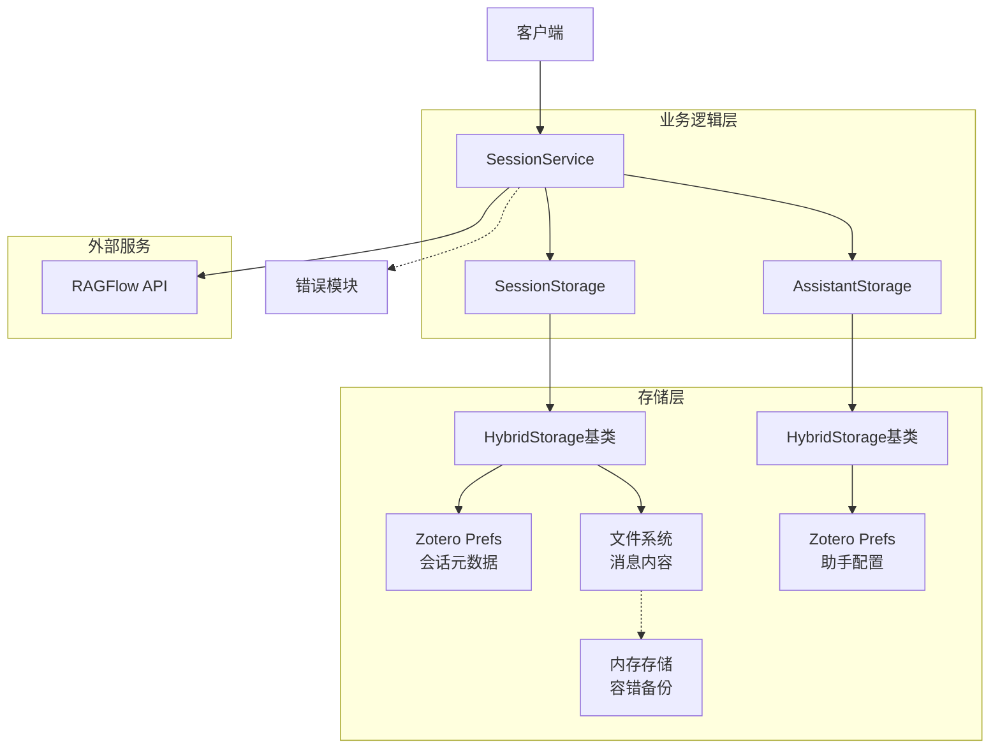
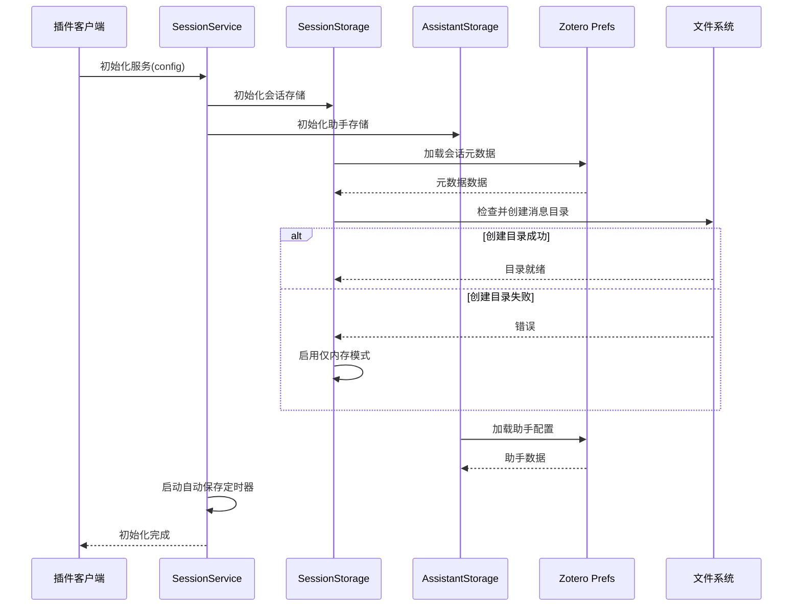
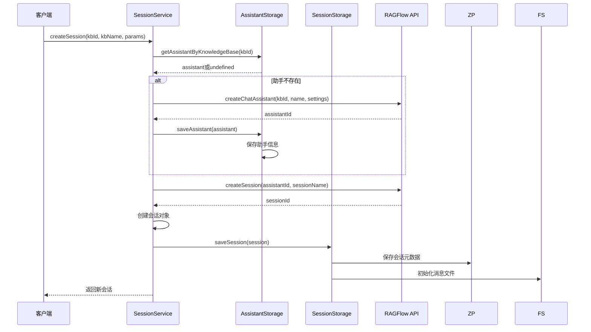
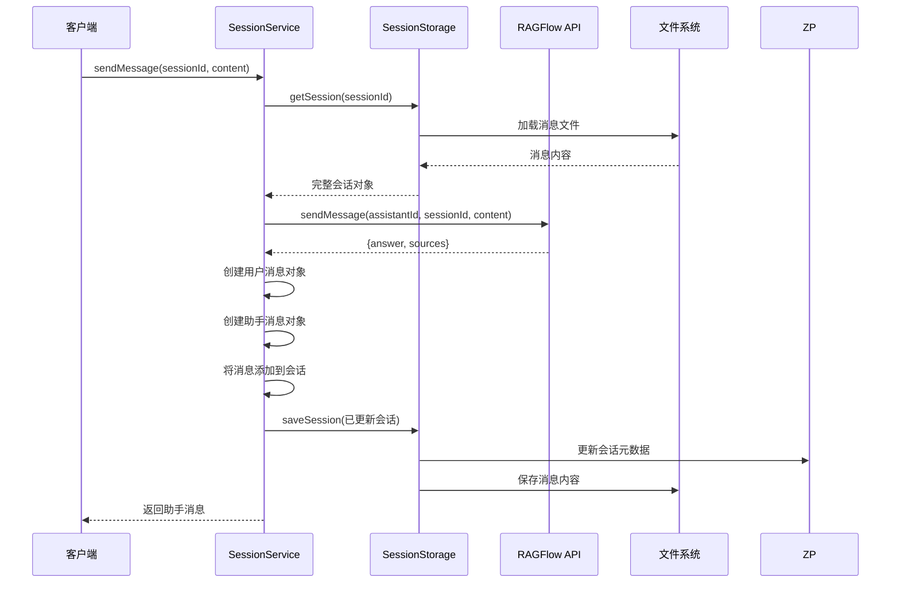
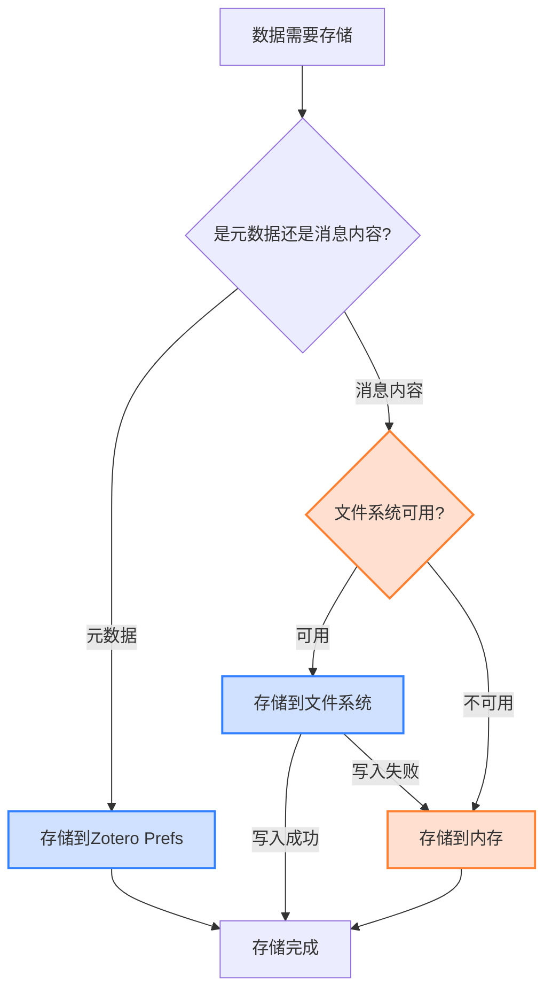
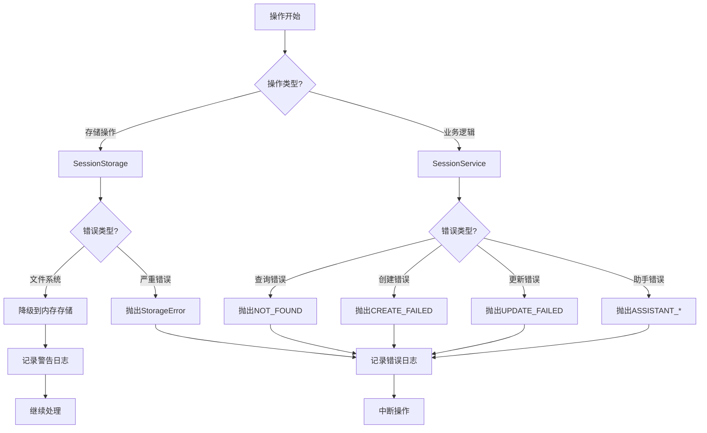
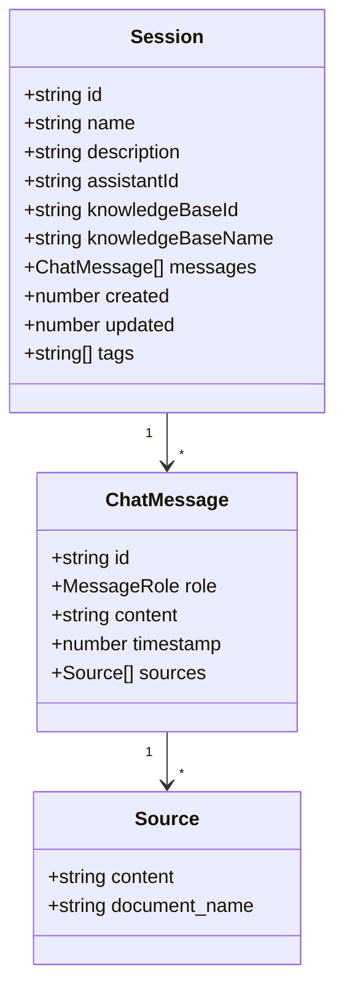
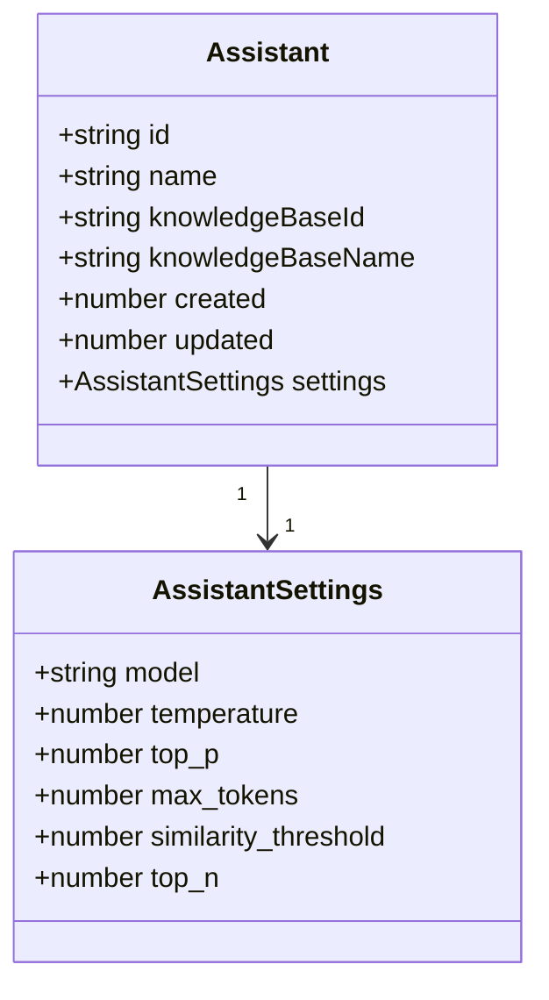

# 会话管理模块

## 模块概述

会话管理模块是RAGFlow插件的核心组件，负责管理用户与AI的交互会话、知识库与助手的关联关系、消息存储和检索等功能。本模块采用分层设计和混合存储策略，提供了稳定、高效的会话管理服务，同时兼顾了性能与用户体验。

## 系统架构



## 核心工作流程

### 1. 系统初始化流程



### 2. 会话创建流程



### 3. 消息交互流程



### 4. 混合存储机制



### 5. 错误处理机制



## 核心组件

### 1. 会话服务 (SessionService)

会话服务是模块的核心，采用单例模式，提供统一的会话管理接口。

主要功能：
- 创建和管理会话与助手
- 发送和接收消息
- 协调存储层操作
- 启动自动保存机制
- 优雅处理错误情况

特点：
- 单例模式确保全局唯一入口
- 自动关联知识库与助手
- 内置兼容旧版存储结构的迁移机制
- 定时自动保存防止数据丢失

代码示例：
```typescript
// 获取会话服务实例
const service = SessionService.getInstance();

// 初始化服务
await service.init();

// 创建新会话
const session = await service.createSession(
  knowledgeBaseId,
  knowledgeBaseName,
  {
    name: "测试会话",
    description: "这是一个测试会话"
  }
);

// 发送消息
const reply = await service.sendMessage(
  session.id,
  "你好，请帮我分析这篇论文的主要观点"
);

console.log(reply.content); // 显示AI回复内容
console.log(reply.sources);  // 显示引用的知识库内容
```

### 2. 混合存储机制 (HybridStorage)

混合存储基类实现了高效的分离存储策略。

特点：
- **元数据存储**：使用Zotero Preferences存储小体积、高频访问的元数据
- **内容存储**：使用文件系统存储大体积消息内容
- **内存备份**：当文件系统不可用时自动降级为内存存储
- **异步操作**：所有存储操作均为异步，不阻塞主线程
- **自动同步**：定时自动保存确保数据持久化

代码示例：
```typescript
// HybridStorage是一个抽象基类
class MyStorage extends HybridStorage<MyDataType> {
  constructor() {
    super("storage.key", "storage/dir");
  }
  
  // 实现特定存储逻辑
  async saveCustomData(data: MyDataType): Promise<void> {
    await this.save(data);
    await this.sync(); // 立即同步到持久存储
  }
}
```

### 3. 会话存储 (SessionStorage)

会话存储负责会话数据的持久化，继承自HybridStorage。

主要功能：
- 会话元数据的存储与检索
- 消息内容的文件系统存储
- 内存缓存和容错机制
- 按知识库和助手ID筛选会话

特点：
- **高兼容性**：尝试多种API确保在不同Zotero版本中工作
- **自动降级**：文件系统不可用时自动降级到内存存储
- **延迟加载**：消息内容按需加载以优化性能
- **路径规范化**：自动处理跨平台路径差异

代码示例：
```typescript
const storage = new SessionStorage();
await storage.init();

// 获取所有会话元数据
const sessions = await storage.getSessions();

// 获取完整会话（包含消息）
const session = await storage.getSession(sessionId);

// 保存更新后的会话
await storage.saveSession(session);
```

### 4. 助手存储 (AssistantStorage)

助手存储管理AI助手的配置和知识库关联。

主要功能：
- 存储助手配置和设置
- 维护助手与知识库的映射关系
- 按知识库ID查找对应助手

代码示例：
```typescript
const storage = new AssistantStorage();
await storage.init();

// 获取所有助手
const assistants = await storage.getAssistants();

// 查找特定知识库的助手
const assistant = await storage.getAssistantByKnowledgeBase(knowledgeBaseId);

// 保存更新后的助手设置
await storage.saveAssistant(updatedAssistant);
```

### 5. 错误处理系统

模块实现了完整的错误类型和处理策略。

特点：
- **类型化错误**：使用枚举定义具体错误类型
- **两级错误体系**：区分业务逻辑错误和存储错误
- **降级策略**：存储错误时采用降级策略
- **详细日志**：错误发生时记录完整上下文

代码示例：
```typescript
try {
  const session = await sessionService.getSession(sessionId);
} catch (error) {
  if (error instanceof SessionError) {
    switch(error.type) {
      case ErrorType.NOT_FOUND:
        // 处理会话不存在情况
        break;
      case ErrorType.STORAGE_ERROR:
        // 处理存储错误
        break;
      default:
        // 处理其他错误
    }
  }
}
```

## 数据模型

### 1. 会话数据模型



### 2. 助手数据模型



## 关键功能说明

### 1. 混合存储策略

混合存储策略解决了Zotero插件中的几个关键挑战：

1. **Zotero Preferences大小限制**：
   - Zotero Prefs有存储大小限制，不适合存储完整消息
   - 混合策略将小体积元数据（kb级别）保存到Prefs
   - 大体积消息内容（mb级别）保存到文件系统

2. **多层降级机制**：
   - 优先使用IOUtils API (最新版Zotero推荐)
   - 如失败，尝试OS.File API
   - 如再失败，回退到Zotero.File API
   - 所有方法都失败时，使用内存存储作为最后手段

3. **跨平台兼容性**：
   - 自动处理Windows和Unix路径差异
   - 规范化路径分隔符
   - 使用安全的路径拼接方法

### 2. 知识库-助手-会话映射

模块采用层次化数据模型管理关系：

1. **知识库到助手映射**：
   - 每个知识库关联一个助手
   - 助手配置专门针对知识库特性优化
   - 支持自动创建和关联

2. **助手到会话映射**：
   - 一个助手可以有多个会话
   - 会话记录与特定助手和知识库的交互历史
   - 支持按知识库或助手筛选会话

这种设计使得用户可以对不同主题的知识库使用不同的AI模型和设置，同时保持对话上下文的连贯性。

### 3. 自动保存机制

为防止数据丢失，模块实现了多层保障：

1. **即时保存**：关键操作立即保存
2. **定时保存**：启动自动保存定时器，默认60秒
3. **内存备份**：所有数据同时保存到内存，防止文件系统故障
4. **重试机制**：存储操作失败时自动尝试备选方法

### 4. 兼容性与迁移

模块支持从旧版格式无缝迁移数据：

1. **优先使用新存储**：检查新格式存储
2. **自动检查旧格式**：如果未找到，尝试查找旧格式数据
3. **迁移处理**：发现旧数据时自动迁移到新格式
4. **双向同步**：更新时同时保存旧格式，确保兼容性

## 错误处理策略

### 1. 分层错误类型

错误处理采用分层设计：

1. **SessionError**：业务逻辑错误
   - `NOT_FOUND`: 找不到指定会话
   - `CREATE_FAILED`: 创建会话失败
   - `UPDATE_FAILED`: 更新会话失败
   - `SEND_FAILED`: 发送消息失败
   - `ASSISTANT_*`: 助手相关错误

2. **StorageError**：存储层错误
   - `INIT_FAILED`: 初始化存储失败
   - `READ_FAILED`: 读取数据失败
   - `WRITE_FAILED`: 写入数据失败
   - `DELETE_FAILED`: 删除数据失败

### 2. 容错与降级策略

模块在各层实现容错机制：

1. **存储层**：
   - 文件系统不可用时降级到内存存储
   - 文件写入失败时保留内存副本
   - 元数据保存优先级高于消息内容

2. **服务层**：
   - 创建会话时自动处理名称冲突
   - 发送消息失败时保留本地记录
   - 查询失败时提供有意义的错误信息

## 性能优化与最佳实践

1. **延迟加载**：
   - 消息内容按需加载
   - 会话列表只加载元数据，完整会话内容按需获取

2. **批量处理**：
   - 一次性获取会话列表再处理
   - 最小化API调用次数

3. **缓存策略**：
   - 内存中保留活跃会话
   - 避免重复读取文件系统

4. **资源控制**：
   - 限制每个会话最大消息数
   - 自动清理超限消息

5. **并发控制**：
   - 异步API防止阻塞主线程
   - 文件操作在后台执行

## 使用示例

### 示例1: 创建会话并发送消息

```typescript
// 初始化服务
const sessionService = SessionService.getInstance();
await sessionService.init();

// 为知识库创建会话
const session = await sessionService.createSession(
  "kb-123",  // 知识库ID
  "研究论文集",  // 知识库名称
  {
    name: "文献分析会话",
    description: "分析最新研究论文",
    assistantSettings: {
      model: "gpt-4",
      temperature: 0.3  // 更精确的回答
    }
  }
);

// 发送第一条消息
const response = await sessionService.sendMessage(
  session.id,
  "请分析最新的机器学习研究趋势"
);

console.log(response.content);  // 显示AI回复
console.log(response.sources);  // 显示引用源
```

### 示例2: 获取现有会话

```typescript
// 获取所有会话
const allSessions = await sessionService.getSessions();

// 按知识库获取会话
const kbSessions = await sessionService.getSessionsByKnowledgeBase("kb-123");

// 获取特定会话
const session = await sessionService.getSession(sessionId);

// 更新会话属性
await sessionService.updateSession(sessionId, {
  name: "已更新的会话名称",
  description: "新的描述信息"
});
```

### 示例3: 助手管理

```typescript
// 获取所有助手
const assistants = await sessionService.getAssistants();

// 获取特定助手
const assistant = await sessionService.getAssistant(assistantId);

// 更新助手设置
await sessionService.updateAssistant(assistantId, {
  name: "精确分析助手",
  settings: {
    model: "claude-2",
    temperature: 0.2,
    top_n: 8  // 增加引用文档数量
  }
});
```

## 待优化事项

- [ ] 实现会话分页加载机制
- [ ] 添加消息压缩功能，减少存储空间占用
- [ ] 优化大量消息场景下的性能
- [ ] 增加更细粒度的日志和诊断功能
- [ ] 改进跨设备会话同步机制
- [ ] 添加会话归档和恢复功能
