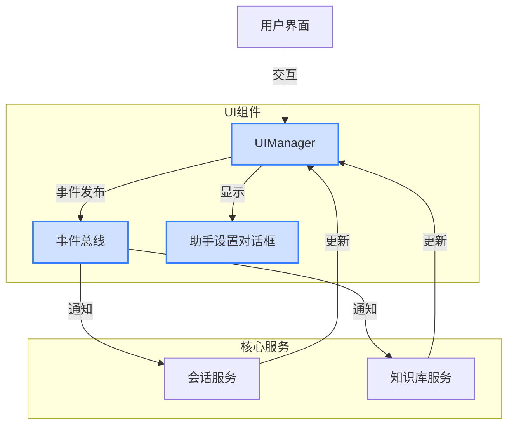
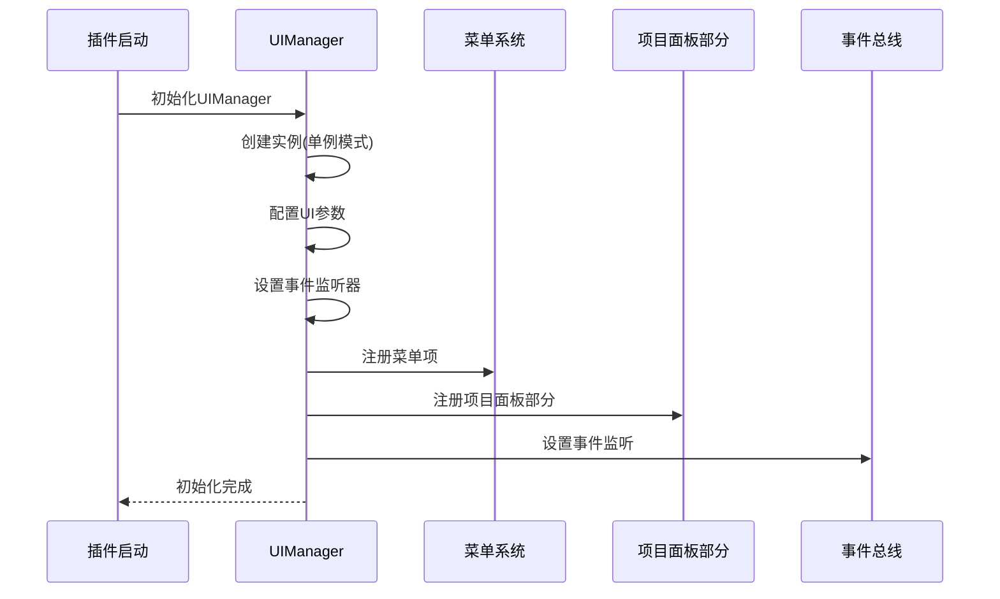
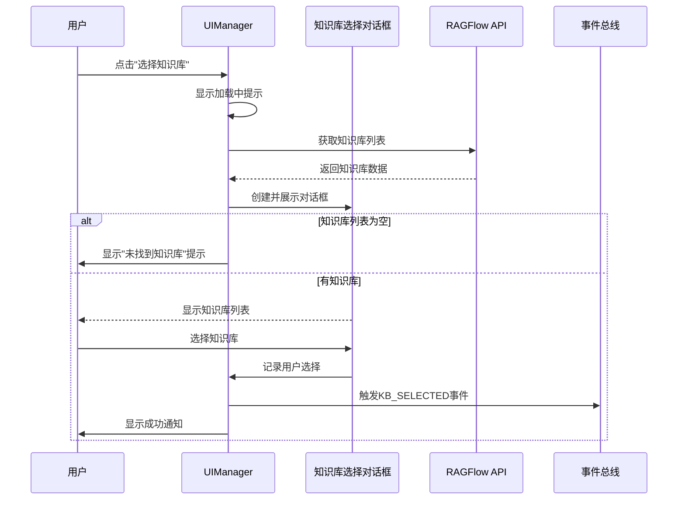
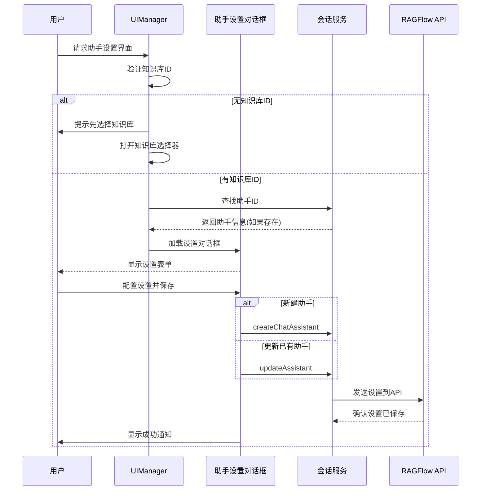
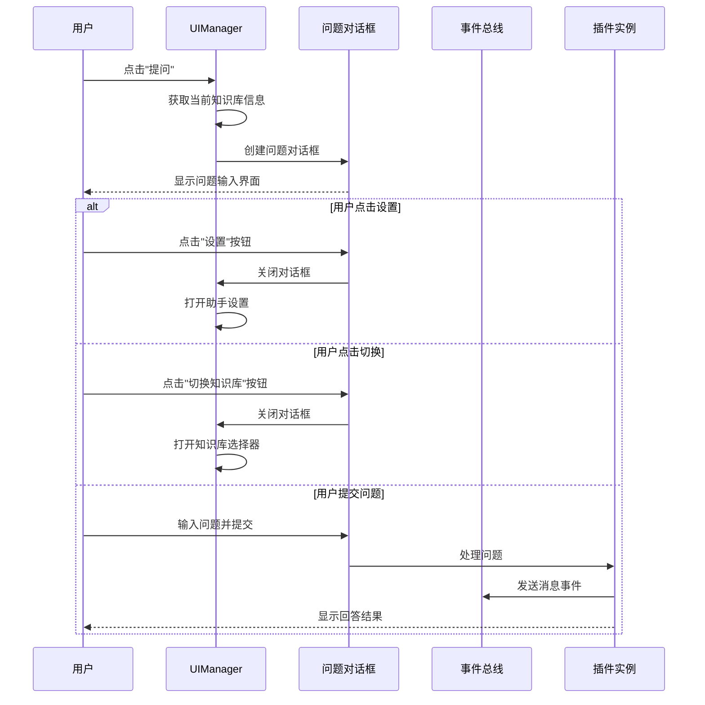
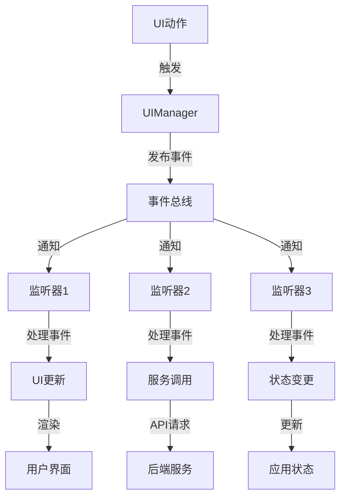

# UI 模块

## 模块概述

UI模块是RAGFlow插件的前端部分，负责用户界面的呈现和交互逻辑。它基于事件驱动架构，实现了与核心服务层的松耦合集成，提供了直观的知识库管理、会话交互和设置配置功能。主要特点包括模块化设计、事件总线通信和响应式UI更新。

> **注意**：`src/modules.next/ui/pane`目录下的代码可能已不再使用，这些组件被新的UI实现所取代。

## 系统架构



## 核心工作流程

### 1. UI初始化流程



### 2. 知识库选择流程



### 3. 助手设置流程



### 4. 问题提问流程



### 5. 事件驱动通信流程



## 核心组件

### 1. UI管理器 (UIManager)

UI管理器是UI模块的核心，采用单例模式，负责统一管理界面元素和交互逻辑。

主要功能：
- 初始化UI组件和事件监听
- 注册菜单项和项目面板部分
- 管理对话框的创建和显示
- 处理用户交互和通知

特点：
- 单例模式确保全局唯一入口
- 支持配置界面尺寸和位置
- 提供完整的面板管理机制
- 实现直观的通知系统

代码示例：
```typescript
// 获取UI管理器实例
const uiManager = UIManager.getInstance({
  defaultPaneWidth: 360,
  defaultPaneHeight: 600,
  position: "right"
});

// 初始化UI
await uiManager.init();

// 显示/隐藏界面
uiManager.show();
uiManager.hide();
uiManager.toggle();

// 显示设置面板
uiManager.showSettingsPanel();
```

### 2. 事件总线 (EventBus)

事件总线实现了类型安全的事件发布-订阅系统，是组件间通信的核心。

特点：
- 使用TypeScript泛型实现类型安全
- 支持细粒度的事件定义
- 保护事件处理器不受错误影响
- 支持灵活的事件订阅和取消订阅

代码示例：
```typescript
// 订阅事件
eventBus.on(Events.KB_SELECTED, ({ id, name }) => {
  console.log(`选择了知识库: ${name} (${id})`);
});

// 发布事件
eventBus.emit(Events.KB_SELECTED, { 
  id: "kb-123", 
  name: "研究论文集" 
});

// 取消订阅
eventBus.off(Events.KB_SELECTED, myHandler);
```

### 3. 助手设置对话框 (AssistantSettingsDialog)

助手设置对话框提供了配置AI助手参数的直观界面。

主要功能：
- 配置语言模型和参数
- 提供多种预设模型选择
- 支持自定义模型
- 保存为默认设置

特点：
- 响应式UI更新
- 支持历史模型记录
- 直观的滑动条参数调整
- 多种参数预览和说明

代码示例：
```typescript
// 显示助手设置对话框
const result = await showAssistantSettingsDialog(
  knowledgeBaseId,
  knowledgeBaseName,
  assistantId // 可选，如更新现有助手
);

// 获取默认设置
const defaultSettings = getDefaultSettings();
```

### 4. 类型定义 (Types)

UI模块提供了丰富的类型定义，确保组件间数据交换的类型安全。

主要类型：
- 组件属性和状态类型
- 配置选项类型
- 事件数据类型

代码示例：
```typescript
// UI配置
const config: UIConfig = {
  paneWidth: 400,
  paneHeight: 600,
  theme: "light"
};

// 组件属性
const props: SessionListProps = {
  sessions: [],
  onSelect: (id) => { /* ... */ },
  onCreate: (kbId, kbName) => { /* ... */ },
  onDelete: (id) => { /* ... */ }
};
```

## 事件系统

### 1. 事件类型

UI模块定义了丰富的事件类型，覆盖用户交互、状态变更和操作结果等场景。

主要事件类别：
- **UI相关事件**：标签页切换、面板可见性等
- **UI交互事件**：设置打开、知识库选择等
- **会话事件**：会话选择、创建、更新、删除
- **消息事件**：发送消息
- **知识库事件**：知识库选择、状态变更
- **同步事件**：同步开始、进度、完成、失败等
- **助手事件**：助手创建、更新、选择

### 2. 事件流处理

事件从发布到处理的完整流程：

1. **事件触发**：用户操作或系统状态变更触发事件
2. **事件发布**：通过`eventBus.emit()`发布事件
3. **事件分发**：事件总线将事件分发给所有订阅者
4. **事件处理**：订阅者执行相应的处理逻辑
5. **错误保护**：任一处理器的错误不会影响其他处理器

### 3. 事件监听模式

常见的事件监听模式：

```typescript
// 组件初始化时设置事件监听
constructor() {
  // 监听知识库选择事件
  eventBus.on(Events.KB_SELECTED, this.handleKnowledgeBaseSelected);
  
  // 监听会话创建事件
  eventBus.on(Events.SESSION_CREATED, this.handleSessionCreated);
}

// 组件销毁时取消事件监听
destroy() {
  eventBus.off(Events.KB_SELECTED, this.handleKnowledgeBaseSelected);
  eventBus.off(Events.SESSION_CREATED, this.handleSessionCreated);
}
```

## UI工作流说明

### 1. 菜单集成

UI模块通过以下方式集成到Zotero主界面：

1. **主菜单**：在Zotero主菜单中添加RAGFlow菜单
2. **右键菜单**：在集合右键菜单中添加"发送到RAGFlow知识库"选项
3. **侧边栏面板**：根据Zotero版本自适应添加面板

菜单注册流程：
```typescript
// 注册主菜单
ztoolkit.Menu.register("menuTools", {
  tag: "menu",
  label: "RAGFlow",
  children: [
    // 子菜单项
  ]
});

// 注册右键菜单
ztoolkit.Menu.register("collection", {
  tag: "menuitem",
  label: "发送到 RAGFlow 知识库",
  oncommand: `/* 处理逻辑 */`
});
```

### 2. 对话框管理

UI模块使用一致的对话框创建和管理模式：

1. **对话框创建**：使用`ztoolkit.Dialog`类创建对话框
2. **数据绑定**：通过`setDialogData`设置数据和回调
3. **生命周期**：通过`loadCallback`和`unloadCallback`处理加载和关闭事件
4. **事件处理**：在对话框内注册DOM事件处理器

对话框创建模式：
```typescript
const dialog = new ztoolkit.Dialog(rows, cols)
  // 添加内容
  .addCell(/* ... */)
  // 添加按钮
  .addButton("保存", "save")
  .addButton("取消", "cancel")
  // 设置数据和回调
  .setDialogData({
    // 初始数据
    someProperty: initialValue,
    // 加载回调
    loadCallback: () => {
      // DOM就绪后的处理
    },
    // 关闭回调
    unloadCallback: () => {
      if (dialog.dialogData._lastButtonId === "save") {
        // 保存处理逻辑
      }
    }
  });

// 打开对话框
dialog.open("对话框标题", options);
```

### 3. 错误处理机制

UI模块实现了多层错误处理策略：

1. **事件总线错误隔离**：每个事件处理器的错误被隔离，不影响其他处理器
2. **UI操作错误捕获**：所有UI操作都包含try-catch捕获，确保UI稳定
3. **详细日志记录**：错误发生时记录完整上下文和堆栈信息
4. **用户友好通知**：以可理解的方式向用户展示错误信息
5. **恢复机制**：错误发生后尝试恢复或提供替代操作

错误处理示例：
```typescript
try {
  // 进行危险操作
  await someRiskyOperation();
} catch (error) {
  // 记录详细错误
  Logger.error({
    message: "操作失败",
    context: "UIManager",
    error: error as Error,
    data: { /* 相关数据 */ }
  });
  
  // 向用户显示友好提示
  this.showNotification("操作无法完成，请稍后再试", "error");
}
```

## 使用示例

### 示例1: 初始化UI管理器

```typescript
// 导入UI管理器
import { uiManager } from "../modules.next/ui";

// 初始化UI
async function initializeUI() {
  try {
    await uiManager.init();
    console.log("UI初始化成功");
  } catch (error) {
    console.error("UI初始化失败:", error);
  }
}

// 调用初始化
initializeUI();
```

### 示例2: 显示知识库选择器

```typescript
// 导入必要组件
import { uiManager, eventBus, Events } from "../modules.next/ui";

// 监听知识库选择事件
eventBus.on(Events.KB_SELECTED, ({ id, name }) => {
  console.log(`选择了知识库: ${name} (${id})`);
  // 更新应用状态
  updateAppState({ currentKnowledgeBaseId: id, currentKnowledgeBaseName: name });
});

// 显示知识库选择器
function showKnowledgeBaseSelector() {
  uiManager.showKnowledgeBaseSelector();
}

// 绑定到按钮
document.getElementById("select-kb-button").addEventListener("click", showKnowledgeBaseSelector);
```

### 示例3: 显示助手设置对话框

```typescript
// 导入必要组件
import { uiManager } from "../modules.next/ui";

// 显示助手设置对话框
async function showAssistantSettings(knowledgeBaseId, knowledgeBaseName) {
  try {
    const result = await uiManager.showAssistantSettings(knowledgeBaseId, knowledgeBaseName);
    
    if (result) {
      console.log("助手设置已保存");
    } else {
      console.log("用户取消了助手设置");
    }
  } catch (error) {
    console.error("无法显示助手设置:", error);
  }
}
```

## 技术亮点

1. **类型安全**：使用TypeScript泛型实现严格的类型检查
2. **事件驱动**：基于事件总线的松耦合架构
3. **自适应UI**：根据Zotero版本自动选择合适的UI集成方式
4. **错误恢复**：多层错误处理和恢复机制
5. **单例模式**：确保UI管理的一致性
6. **响应式更新**：基于事件的UI状态更新

## 兼容性注意事项

1. **Zotero版本**：UI模块支持Zotero 6和Zotero 7，但集成方式略有不同
2. **废弃组件**：`pane`目录下的组件可能已被新实现取代
3. **API变更**：部分API在Zotero 7中已被弃用，如`Zotero.require`
4. **XUL vs HTML**：混合使用XUL和HTML元素，需要注意命名空间差异

## 可能的改进方向

- [ ] 实现完全组件化的UI系统，替代当前的混合模式
- [ ] 添加主题支持，实现深色模式和自定义主题
- [ ] 提升对话框系统的复用性
- [ ] 改进错误处理的用户体验
- [ ] 优化对各种屏幕尺寸的适配
